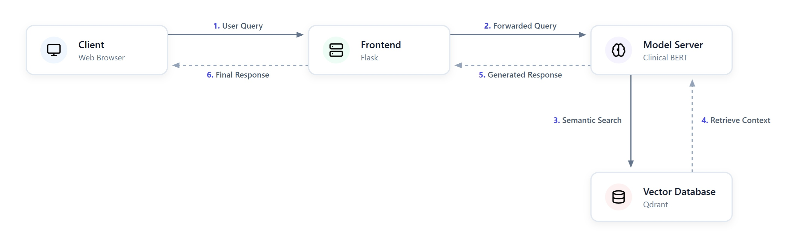

# MedExpert

**Live App**: https://med-expert.enkwadore.com

A specialized machine learning system for answering medical questions using Retrieval-Augmented Generation (RAG). Extract precise answers about medical topics (such as pressure ulcers) from a curated knowledge base using a fine-tuned Bio_ClinicalBERT model, with a modern web interface and containerized deployment.

## Features

- **Medical Question Answering**: Fine-tuned Bio_ClinicalBERT model specialized for medical context and terminology
- **RAG Architecture**: Integration with Qdrant vector database for fast and accurate document retrieval
- **Semantic Search**: Powered by `sentence-transformers/all-MiniLM-L6-v2` for high-quality dense vector embeddings
- **Modern Web Interface**: Flask-based frontend chat application for intuitive interaction
- **Confidence Scoring**: Configurable confidence thresholds to ensure reliable answers and mitigate hallucination
- **Container Orchestration**: Full Docker Compose setup for seamless model serving and API management

## Architecture



## Quick Start

### Prerequisites

- **Docker** & **Docker Compose**
- **Git**
- Existing Qdrant vector database running on `mlops-net` external network (at `http://qdrant:6333`)
- Fine-tuned model stored in `./models/fine_tuned/bio_clinical_bert`

### Installation & Deployment

1. **Clone the repository**
   ```bash
   git clone git@github.com:scaihai/ai-med-expert.git
   cd ai-med-expert
   ```

2. **Build and start services**
   ```bash
   docker-compose up -d --build
   ```

   This will:
   - Build and start the FastAPI model server on http://localhost:8000
   - Build and start the Flask frontend on http://localhost:8082

3. **Stop services**
   ```bash
   docker-compose down
   ```

## Usage

### Web Interface

1. Navigate to http://localhost:8082
2. Ask a medical question in the chat interface.
3. The system processes the query, searches the knowledge base, and displays:
   - The extracted answer to your question
   - The confidence score of the answer
   - The context used to generate the answer

## Configuration

### Model Configuration

- **QA Model Framework**: PyTorch / Transformers
- **QA Model Architecture**: Bio_ClinicalBERT
- **Embedding Model**: `sentence-transformers/all-MiniLM-L6-v2`
- **Vector Database**: Qdrant
- **Collection Name**: `pressure_ulcers`

## API Documentation

### Flask Backend Endpoints

| Endpoint | Method | Description |
|----------|--------|-------------|
| `/` | GET | Serves the web interface |
| `/api/ask` | POST | Proxy for asking questions. Accepts JSON with `question` and `confidence_threshold` |

### FastAPI Model Server

**Health Check**: `http://localhost:8000/health`
Returns the status of the model server and whether the QA pipeline and embedder are loaded.

**Prediction**: `http://localhost:8000/predict`
Accepts a JSON payload with `question` and `confidence_threshold` and returns the `answer`, `confidence` score, and `context_used`.

## Dependencies

### Frontend
- Flask 3.1.1
- Requests 2.32.3
- Gunicorn 23.0.0

### Model Server
- FastAPI 0.115.12
- Uvicorn 0.34.2
- PyTorch 2.7.0
- Transformers >=4.46.0,<5.0.0
- Sentence-Transformers >=3.0.0
- Qdrant-Client 1.14.2
- NumPy <2.0.0

### Infrastructure
- Docker Engine
- Docker Compose
- Qdrant Vector Database

## Author

Created by Destiny Gogo-fyneface as part of Advanced Topics in Deep Learning coursework.
